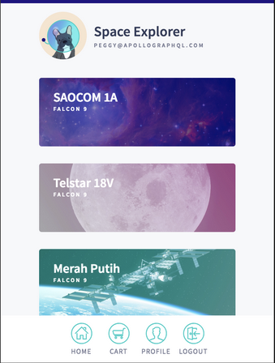

- [主页](../README.md)

## 说在前面
### 从这里开始学习如何构建全栈应用

    欢迎各位，你可以通过这个教程指南学习如何使用强大的GraphQL构建全栈应用，废话不多说，直接进入主题。

### 我们将构建什么

一款为SpaceX飞船发射预定座位的软件

像下面这样：




这个应用包含：

- 登陆页
- 即将发布的清单
- 发射平台的细节景观
- 用户的主页信息
- 购物车

为了实现这些功能，我们需要连接两个数据源，REST API和SQLite 数据库。不过不用担心，你无需了解这两种技术细节。

还必须提到的是，为了构建真正符合规范的应用，我们还必须用到身份验证，分页，以及状态管理。

### 先决条件
本教程需要你熟悉 `JavaScript/ES6` 和 `React`, 如果你要复习一下， Click it [🔗](https://reactjs.org/tutorial/tutorial.html), 还有，你可以学习一下GraphQL [😄Click me](https://graphql.org/learn/queries/)

#### 系统环境要求
- Node.js v8.x or later
- npm v6.x or later
- git v2.14.1 or later

同样也建议你使用 [VS Code](https://code.visualstudio.com/) 编辑器来写代码。以便使用apollo的插件

#### 克隆APP例子

克隆这个仓库：

```shell
git clone https://github.com/GZ315200/fullstack_tutorial.git
```

克隆成功后，你可以看到两个文件，final 和 start, final是最终的代码，start是用来练习这个教程的demo，他们分别下面有两个文件，一个是client，另一个是server，server端构建graph API用到的。
client端是用来浏览器访问的静态页面

`不废话了，开始我们下一章节吧`

- [下一页](./build_a_schema.md)